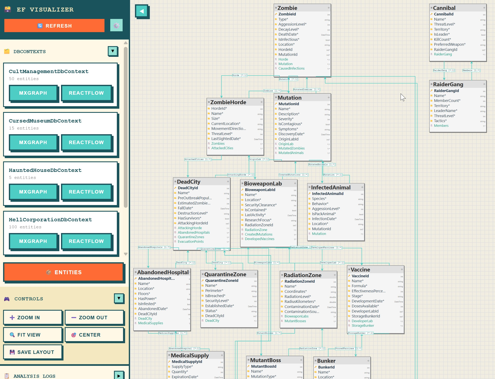

# efvis - Entity Framework Visualizer

Entity Framework DbContext visualizer for VS Code.

Press `F1` → `efvis: Show EF Diagram`

## What it does

Automatically scans your workspace for .csproj files, compiles the projects, finds all Entity Framework database models (DbContext classes), and creates interactive diagrams showing:
- Entity relationships and properties
- Primary keys and foreign keys
- Navigation properties
- Drag & drop positioning with persistent layout

## How to use

1. Install the extension
2. Press `F1` → `efvis: Show EF Diagram`
3. First run may take longer as the analyzer needs to compile (requires .NET SDK)

## Features

### Visualization Engines
- **MxGraph**: Enterprise-grade with advanced layout algorithms and entity search panel
- **ReactFlow**: Modern React-based with smooth interactions

### Auto-Layout Algorithms
- **Dagre**: Hierarchical directed graph layout
- **ELK**: Eclipse Layout Kernel with multiple algorithms
- **D3-Force**: Physics-based force simulation

### Layout & Navigation
- **Persistent Layout**: Node positions automatically saved and restored
- **Entity Search**: Quick search panel with instant graph navigation (MxGraph)
- **Direction**: Top-Bottom, Left-Right, Bottom-Top, Right-Left
- **Spacing**: Node spacing, rank spacing, edge spacing
- **Alignment**: Upper-left, upper-center, upper-right, etc.

### Layout Files
Layout positions are saved in workspace root as JSON files:
- **ReactFlow**: `.efvis-reactflow-layout.{ContextName}.json`
- **MxGraph**: `.efvis-mxgraph-layout.{ContextName}.json`

Where `{ContextName}` is your DbContext class name (e.g., `.efvis-reactflow-layout.ApplicationDbContext.json`)

### Edge Routing & Styling
- **Routing**: Orthogonal, polyline, splines, straight
- **Styles**: Smoothstep, straight, step, simple bezier
- **Animation**: Animated connection flows
- **Connection modes**: Loose, strict

### Experimental Features
- **Grid**: Snap-to-grid with customizable size
- **Font sizes**: Entity names, properties, navigation properties
- **Collision detection**: Force layout collision radius and strength
- **Port constraints**: Fixed, free, undefined positioning
- **Fallback Mode**: When projects don't compile, uses regex-based parsing to find DbContext classes and DbSet properties. Provides basic entity names but no detailed properties or relationships.

## Why?

As an indie developer, I used to rely on Devart Entity Developer, generating data contexts with custom T4 templates. Now everything has changed - Claude Code and Codex generate class structures themselves using code-first approach based on my task descriptions. But I often need to visually see the class structure to understand how to implement new features correctly, what needs to be changed, or to catch when AI goes wild with database design.

That's why I needed a simple tool that requires no configuration, no database connection strings, and works with just one button press.

Hope it will be useful for you too.

## Requirements

- VS Code 1.74.0+
- .NET SDK 6.0+

---

*Built entirely by Claude Code while the human just pressed F5 and complained about bugs*